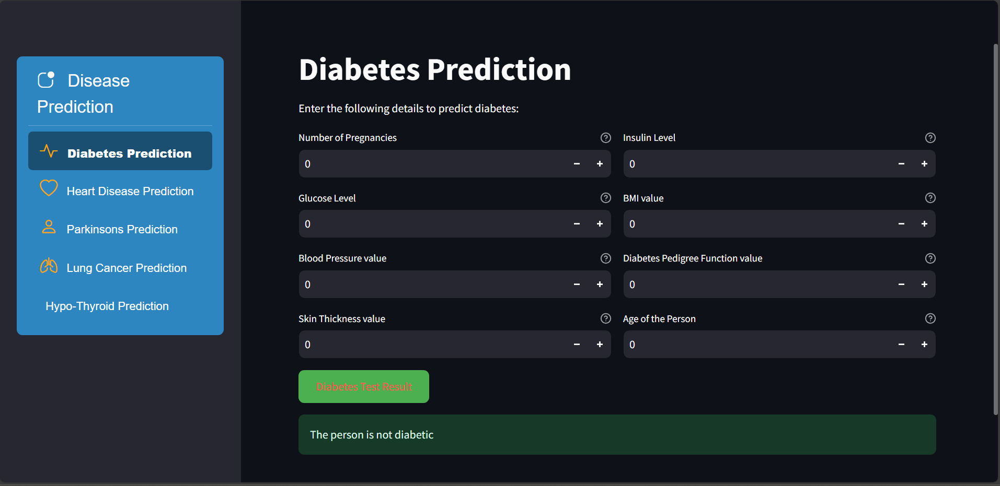
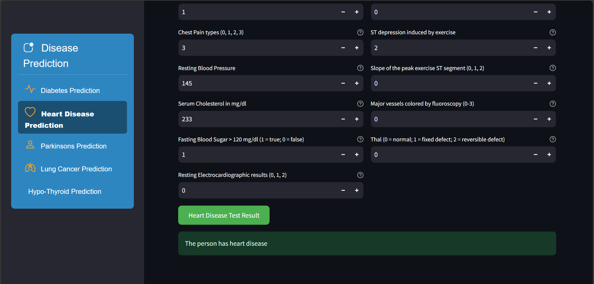
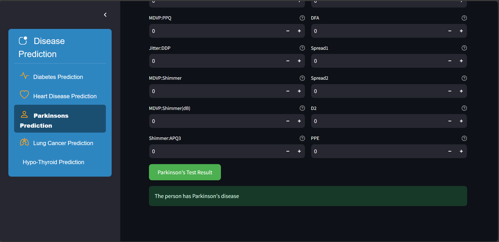
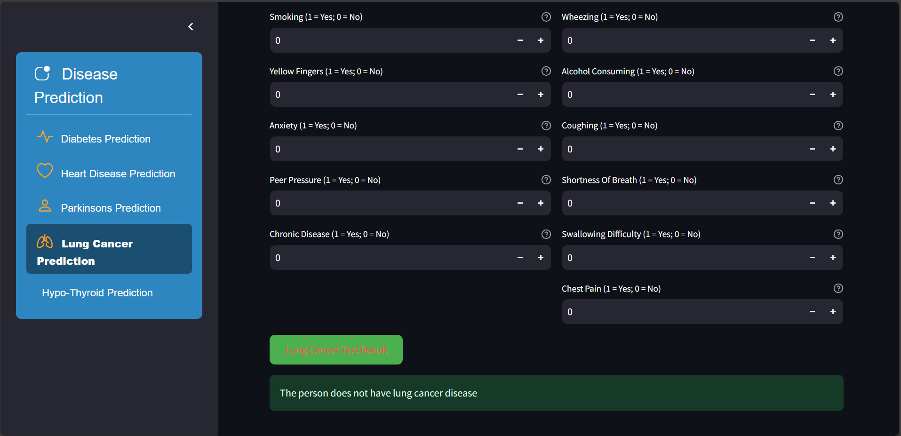
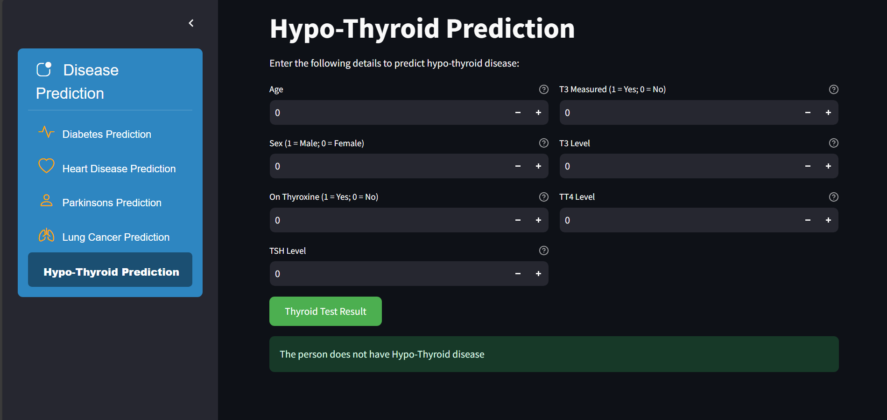

# AI-Powered Predictive Medical Diagnosis System


The **Disease Prediction System** is a web-based application built using **Streamlit** and **Python**. It allows users to predict the likelihood of various diseases based on input features. The system uses pre-trained machine learning models to provide predictions for diseases such as Diabetes, Heart Disease, Parkinson's Disease, Lung Cancer, and Hypo-Thyroid.

---


## Features

- **Disease Prediction**: Predict the likelihood of diseases using machine learning models.
- **User-Friendly Interface**: Simple and intuitive interface for entering input features.
- **Multiple Diseases Supported**:
   - Diabetes Prediction
   - Heart Disease Prediction
   - Parkinson's Disease Prediction
   - Lung Cancer Prediction
   - Hypo-Thyroid Prediction
- **Real-Time Results**: Get instant predictions after entering the required inputs.

---

## Screenshots

Below are some screenshots of the application in action:

<p align="center">
   
   
   
   
   
</p>

---

---

## Technologies Used

- **Streamlit**: For building the web application interface.
- **Python**: For backend logic and machine learning integration.
- **Scikit-Learn**: For machine learning models.
- **Pickle**: For loading pre-trained models.
- **Pandas/Numpy**: For data handling and preprocessing.

---

## Installation

Follow these steps to set up the project on your local machine.

### Prerequisites

- Python 3.8 or higher
- Pip (Python package installer)

### Steps

1. **Clone the Repository**:
   ```bash
   git clone [https://github.com/Yogiii13/AI-Powered-Predictive-Medical-Diagnosis-System.git]
   cd AI-Powered-Predictive-Medical-Diagnosis-System
   ```

2. **Create a Virtual Environment** (Optional but recommended):
   ```bash
   python -m venv venv
   source venv/bin/activate  # On Windows, use `venv\Scripts\activate`
   ```

3. **Install Dependencies**:
   ```bash
   pip install -r requirements.txt
   ```

4. **Run the Application**:
   ```bash
   streamlit run app.py
   ```

5. **Access the Application**:
   Open your browser and go to `http://localhost:8501`.

---

## Deployment to Streamlit Cloud

This application is ready to deploy to **Streamlit Community Cloud**. Follow these steps:

### Prerequisites
- A GitHub account with this repository
- A Streamlit Community Cloud account (free at [share.streamlit.io](https://share.streamlit.io))

### Deployment Steps

1. **Push to GitHub**:
   ```bash
   git add .
   git commit -m "Ready for deployment"
   git push origin main
   ```

2. **Deploy on Streamlit Cloud**:
   - Go to [share.streamlit.io](https://share.streamlit.io)
   - Click "New app"
   - Select your repository, branch (main), and file (`app.py`)
   - Click "Deploy"

3. **Configuration**:
   - The repository includes `.streamlit/config.toml` for optimal performance
   - `runtime.txt` ensures Python 3.10.12 compatibility
   - `requirements.txt` specifies all dependencies with compatible versions

### Important Notes
- **Python Runtime**: This app uses Python 3.10.12 (specified in `runtime.txt`) to ensure all packages have prebuilt wheels
- **Dependencies**: All packages in `requirements.txt` are pinned to versions compatible with Python 3.10
- **Models**: Pre-trained models in `Model/` folder are included automatically with the deployment
- **Build Time**: First deployment takes 2-3 minutes; subsequent updates are faster

### Troubleshooting Deployment
- If build fails, verify all model files exist in `Model/` folder
- Ensure `requirements.txt` hasn't been manually modified with incompatible versions
- Check Streamlit Cloud deployment logs for specific errors

---

## Usage

1. **Select a Disease**:
   - Use the sidebar to select the disease you want to predict.

2. **Enter Input Features**:
   - Fill in the required input fields for the selected disease.

3. **Get Prediction**:
   - Click the "Test Result" button to get the prediction.

4. **View Results**:
   - The prediction result will be displayed on the screen.

---

## Project Structure

```
disease-prediction-system/
├── app.py                  
├── Model/                  
│   ├── diabetes_model.sav
│   ├── heart_disease_model.sav
│   ├── parkinsons_model.sav
│   ├── lungs_disease_model.sav
│   └── Thyroid_model.sav
├── requirements.txt        
└── README.md               
```

---

## Models Used

The system uses the following pre-trained machine learning models:

1. **Diabetes Prediction**: Support Vector Machine (SVM)
2. **Heart Disease Prediction**: Logistic Regression
3. **Parkinson's Disease Prediction**: Support Vector Machine (SVM)
4. **Lung Cancer Prediction**: Logistic Regression
5. **Hypo-Thyroid Prediction**: Logistic Regression

---

## Contributing

Contributions are welcome! If you'd like to contribute, please follow these steps:

1. Fork the repository.
2. Create a new branch (`git checkout -b feature/YourFeatureName`).
3. Commit your changes (`git commit -m 'Add some feature'`).
4. Push to the branch (`git push origin feature/YourFeatureName`).
5. Open a pull request.

---

## Acknowledgments

- The pre-trained models used in this project were trained on publicly available datasets.
- Thanks to the **Streamlit** team for providing an excellent framework for building web applications.

---

## Contact

For any questions or feedback, feel free to reach out:

- **Yogesh Yadav**
- **Email**: yogeshyadav14434@gmail.com
- **GitHub**: https://github.com/Yogiii13

